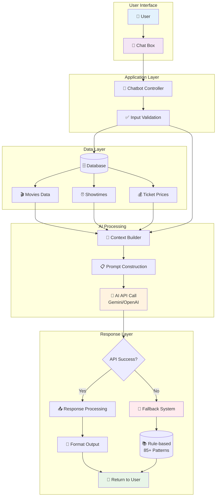
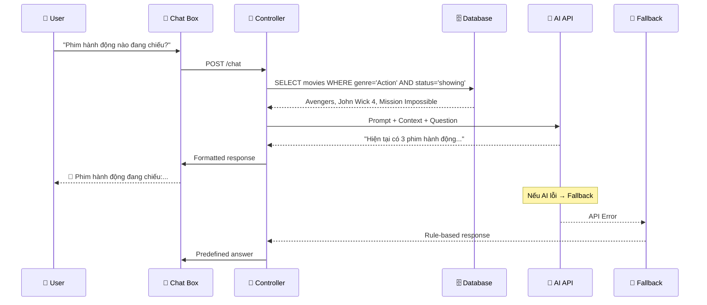

# SƠ ĐỒ LUỒNG XỬ LÝ AI CHATBOT

## 1. Sơ Đồ Tổng Quan (Mermaid)

## 2. Sơ Đồ Chi Tiết Theo Bước

```mermaid
flowchart LR
    subgraph "Bước 1: Nhận Tin Nhắn"
        A1[👤 User nhập câu hỏi] --> A2[💬 Chat Box nhận input]
    end

    subgraph "Bước 2: Xử Lý Đầu Vào"
        A2 --> B1[🎯 Controller nhận request]
        B1 --> B2[✅ Validate input data]
        B2 --> B3[🔍 Kiểm tra tính hợp lệ]
    end

    subgraph "Bước 3: Truy Vấn Database"
        B3 --> C1[🗄️ Query Movies table]
        C1 --> C2[⏰ Query Showtimes table]
        C2 --> C3[💰 Query Prices table]
        C3 --> C4[📊 Tổng hợp dữ liệu thực tế]
    end

    subgraph "Bước 4: Xây Dựng Context"
        C4 --> D1[📝 System Prompt Template]
        D1 --> D2[🔗 Inject Database Context]
        D2 --> D3[❓ Thêm User Question]
        D3 --> D4[📋 Final Prompt Ready]
    end

    subgraph "Bước 5: Gọi AI API"
        D4 --> E1[🌐 HTTP Request to AI API]
        E1 --> E2[🤖 Gemini/OpenAI Processing]
        E2 --> E3[📨 Receive AI Response]
    end

    subgraph "Bước 6: Xử Lý Phản Hồi"
        E3 --> F1{Response Valid?}
        F1 -->|Yes| F2[🎨 Format for Chat Box]
        F2 --> F3[📤 Send to User Interface]
        F1 -->|No| F4[🔄 Trigger Fallback]
    end

    subgraph "Bước 7: Fallback Mechanism"
        F4 --> G1[📚 Rule-based Lookup]
        G1 --> G2[85+ Predefined Patterns]
        G2 --> G3[🔍 Match User Question]
        G3 --> F3
    end

    style A1 fill:#e3f2fd
    style B1 fill:#f3e5f5
    style C1 fill:#fff3e0
    style D1 fill:#e8f5e8
    style E1 fill:#ffebee
    style F1 fill:#fce4ec
    style G1 fill:#e0f2f1
```

## 3. Ví Dụ Minh Họa

**Scenario: User hỏi "Phim hành động nào đang chiếu?"**

## 4. Lợi Ích Của Sơ Đồ

- **Trình bày Defense**: Dễ dàng giải thích cho hội đồng
- **Technical Documentation**: Tài liệu cho developer
- **User Understanding**: Giúp stakeholder hiểu quy trình
- **Troubleshooting**: Xác định điểm lỗi nhanh chóng
- **System Optimization**: Nhận diện bottleneck và cải thiện

## 5. Công Cụ Tạo Sơ Đồ

- **Mermaid Live Editor**: https://mermaid.live/
- **PlantUML Online**: https://www.plantuml.com/plantuml/
- **Draw.io**: https://app.diagrams.net/
- **Lucidchart**: https://www.lucidchart.com/

> 💡 **Lưu ý**: Sử dụng sơ đồ này trong báo cáo đồ án để minh họa kiến trúc AI system một cách trực quan và chuyên nghiệp.

