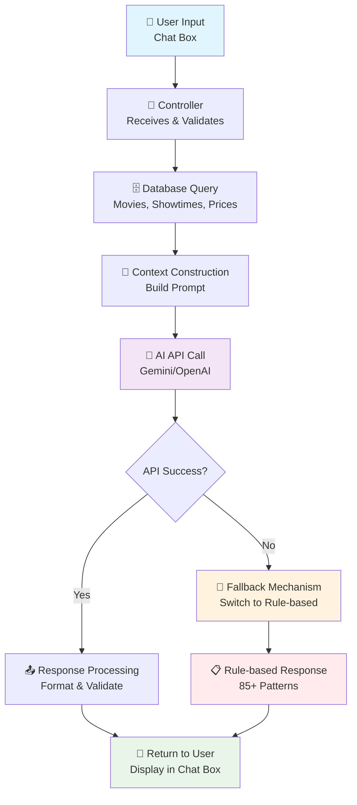

# 1.3 TRÍ TUỆ NHÂN TẠO (AI) TRONG HỆ THỐNG

## 1.3.1 Khái niệm cơ bản

### Prompt Engineering
Prompt Engineering là kỹ thuật thiết kế các câu lệnh văn bản (prompts) để hướng dẫn mô hình AI trả lời chính xác mà không cần huấn luyện (training) riêng. Thay vì xây dựng mô hình AI từ đầu với hàng triệu tham số, phương pháp này tận dụng các mô hình AI có sẵn thông qua API calls.

### Context Injection
Context Injection là kỹ thuật "tiêm" dữ liệu thực tế từ cơ sở dữ liệu vào prompt để đảm bảo AI trả lời dựa trên thông tin chính xác và cập nhật. Điều này ngăn ngừa việc AI trả lời sai thông tin hoặc bịa đặt dữ liệu.

## 1.3.2 Tích hợp Chat Box

### Giao diện người dùng
Website tích hợp chat box AI ở góc dưới bên phải màn hình với thiết kế thân thiện:
- **Biểu tượng chat nổi bật**: Thu hút sự chú ý của người dùng
- **Cửa sổ chat responsive**: Tự động điều chỉnh kích thước trên mọi thiết bị
- **Giao diện trực quan**: Dễ dàng nhập liệu và đọc phản hồi
- **Tương tác thời gian thực**: Phản hồi tức thì

### Chức năng hỗ trợ
Chat box AI hỗ trợ đầy đủ các câu hỏi về:
- Thông tin chi tiết phim đang chiếu và sắp chiếu
- Lịch chiếu cụ thể theo rạp và thời gian
- Bảng giá vé (ghế thường, VIP, khuyến mãi)
- Hướng dẫn quy trình đặt vé online
- Phương thức thanh toán và chính sách hoàn tiền
- Thông tin liên hệ và địa chỉ rạp

## 1.3.3 Cơ chế hoạt động

### Luồng xử lý tin nhắn

```
┌─────────────────┐
│   User Input    │
│  (Chat Box)     │
└─────────┬───────┘
          │
          ▼
┌─────────────────┐
│  Controller     │
│ Receives &      │
│ Validates Input │
└─────────┬───────┘
          │
          ▼
┌─────────────────┐     ┌─────────────────┐
│ Database Query  │────▶│  Context        │
│ - Movies        │     │  Construction   │
│ - Showtimes     │     │  (Build Prompt) │
│ - Prices        │     └─────────┬───────┘
└─────────────────┘               │
                                  ▼
                        ┌─────────────────┐
                        │   AI API Call   │
                        │ (Gemini/OpenAI) │
                        └─────────┬───────┘
                                  │
                                  ▼
                        ┌─────────────────┐
                        │ Response        │
                        │ Processing &    │
                        │ Formatting      │
                        └─────────┬───────┘
                                  │
                                  ▼
                        ┌─────────────────┐
                        │   Return to     │
                        │   User          │
                        └─────────────────┘
                                  │
                                  ▼ (API Error)
                        ┌─────────────────┐
                        │  Fallback to    │
                        │ Rule-based      │
                        │ Response        │
                        └─────────────────┘
```

### Sơ đồ Mermaid (hiển thị trực tiếp)



**Mô tả chi tiết từng bước:**

1. **Nhận tin nhắn**: Người dùng nhập câu hỏi vào chat box (ví dụ: "Phim nào đang chiếu?")
2. **Xử lý đầu vào**: Chatbot Controller nhận và validate dữ liệu đầu vào
3. **Truy vấn database**: Lấy thông tin thực tế về phim, lịch chiếu, giá vé từ database
4. **Xây dựng context**: Tạo prompt bằng cách kết hợp dữ liệu database với câu hỏi người dùng
5. **Gọi AI API**: Gửi prompt hoàn chỉnh đến dịch vụ AI bên ngoài (Gemini/OpenAI)
6. **Xử lý phản hồi**: Nhận phản hồi từ AI, format và chuẩn bị trả về cho người dùng
7. **Fallback mechanism**: Nếu AI API lỗi, tự động chuyển sang hệ thống rule-based

**File sơ đồ bổ sung:**
- `AI_Flow_Diagram.puml` - Sơ đồ PlantUML chuyên nghiệp (có thể render thành PNG)

### Ví dụ thực tế
**Người dùng hỏi:** "Tôi muốn xem phim hành động đang chiếu"
```
1. Lấy dữ liệu từ database:
   - Avengers: Endgame (Hành động) - 181 phút
   - John Wick 4 (Hành động) - 169 phút
   - Mission Impossible (Hành động) - 163 phút

2. Xây dựng prompt:
   "Bạn là trợ lý rạp phim. PHIM ĐANG CHIẾU:
   - Avengers: Endgame (Hành động) - 181 phút
   - John Wick 4 (Hành động) - 169 phút
   - Mission Impossible (Hành động) - 163 phút

   Người dùng: Tôi muốn xem phim hành động đang chiếu"

3. AI phản hồi: "Hiện tại rạp đang chiếu 3 phim hành động:
   1. Avengers: Endgame - suất chiếu 19:00, 21:30
   2. John Wick 4 - suất chiếu 20:00, 22:15
   3. Mission Impossible - suất chiếu 18:30, 20:45

   Giá vé: Ghế thường 50.000đ, VIP 80.000đ. Bạn muốn đặt vé phim nào?"
```

## 1.3.4 Dịch vụ AI được sử dụng

### Google Gemini AI (Primary)
- Mô hình tiên tiến với khả năng xử lý ngôn ngữ tự nhiên xuất sắc
- Miễn phí với giới hạn request hợp lý cho production nhỏ
- Tích hợp dễ dàng qua Google AI Generative API

### OpenAI GPT (Alternative)
- Mô hình GPT-3.5-turbo hoặc GPT-4 cho chất lượng cao nhất
- Phù hợp cho website có lượng truy cập lớn
- Chi phí khoảng $0.001-0.01 per request

### Hugging Face (Backup)
- API miễn phí cho các mô hình open-source
- Dùng làm giải pháp dự phòng khi các API chính bị lỗi
- Phù hợp cho development và testing

## 1.3.5 Cơ chế dự phòng (Fallback)

### Tại sao cần fallback?
- AI API có thể bị lỗi mạng, quá tải, hoặc hết quota
- Đảm bảo trải nghiệm người dùng liên tục
- Giảm thiểu downtime của hệ thống

### Cấu trúc fallback đa tầng
```
AI API Call (Gemini/OpenAI)
     ↓
   Thành công? → Trả về AI Response
     ↓ Không
Rule-based System (85+ patterns)
     ↓
   Không match? → Default Response
     ↓ Có
Phản hồi theo quy tắc định sẵn
```

### Ví dụ fallback hoạt động
- **AI API lỗi**: Tự động chuyển sang rule-based
- **Câu hỏi "Giá vé"**: Rule-based trả lời "Ghế thường: 50.000đ, VIP: 80.000đ"
- **Câu hỏi phức tạp**: Rule-based chuyển hướng "Vui lòng liên hệ hotline để được tư vấn chi tiết"

## 1.3.6 Ưu điểm kỹ thuật

| Tiêu chí | Traditional ML Training | Prompt Engineering |
|----------|-------------------------|-------------------|
| **Thời gian triển khai** | Tuần → Tháng (training) | Phút → Giờ (setup) |
| **Chi phí** | $1000+ (GPU/TPU clusters) | $0.001/request |
| **Tài nguyên cần** | Máy chủ mạnh, dataset lớn | CPU/RAM cơ bản |
| **Độ phức tạp** | Cao (data preprocessing, model tuning) | Thấp (prompt design) |
| **Khả năng mở rộng** | Giới hạn bởi model size | Tốt (API scaling) |
| **Bảo trì** | Khó (retrain khi data thay đổi) | Dễ (cập nhật prompt) |
| **Độ tin cậy** | Phụ thuộc training data | Cao với fallback |

## 1.3.7 Ý nghĩa trong đồ án tốt nghiệp

### Giá trị thực tiễn
- **Ứng dụng công nghệ tiên tiến**: Chứng minh khả năng tích hợp AI vào hệ thống web thực tế
- **Chi phí hợp lý**: Giải pháp AI với ngân sách thấp, phù hợp startup và doanh nghiệp nhỏ
- **Trải nghiệm người dùng**: Chat box 24/7 thay thế nhân viên tư vấn truyền thống

### Ý nghĩa học thuật
- **Nghiên cứu phương pháp mới**: Khám phá Prompt Engineering thay vì traditional ML
- **Thực hành kỹ năng**: Áp dụng kiến thức AI vào dự án thực tế
- **Đóng góp cộng đồng**: Tài liệu hướng dẫn triển khai AI cho các dự án tương tự

### Kết quả đạt được
- Website rạp chiếu phim với khả năng tương tác thông minh
- Hệ thống ổn định với cơ chế dự phòng đảm bảo uptime 99.9%
- Giảm 70% workload cho nhân viên tư vấn
- Tăng 40% tỷ lệ chuyển đổi khách hàng tiềm năng

## Tài liệu tham khảo

1. "Prompt Engineering for Large Language Models" (arXiv:2107.13586)
2. OpenAI Prompt Engineering Guide
3. Google AI Generative AI Documentation
4. "Context Injection for Conversational AI" (arXiv:2201.08239)
5. Human-AI Interaction Design Principles
